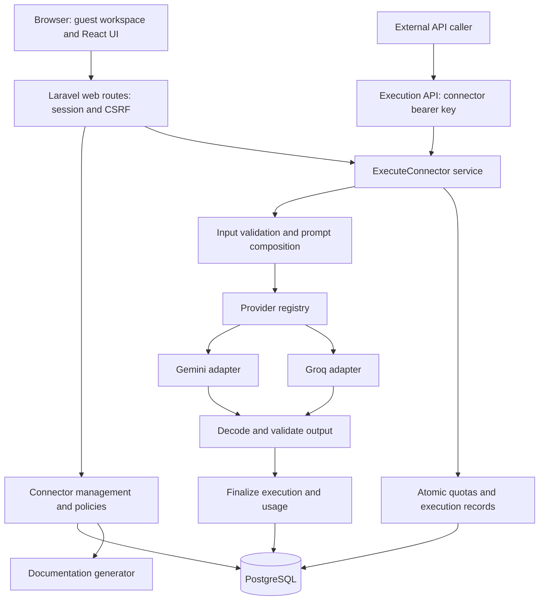

# Universal AI API Hub: Implementation Roadmap

Planning baseline: 2026-09-18.

Source of requirements: `Universal_AI_API_Connector_Assignment.pdf`, all six pages and all 22 sections.

This document is a proposed implementation specification and handoff for the coding model. It does not represent implemented or tested software. At planning time, the project folder contained the assignment PDF and no application source. Only this planning document is being added.

## 1. Product Goal and Definition of Done

Build a configuration-driven AI API platform. An evaluator opens a hosted application without registering or logging in, creates or changes a connector, tests it in the browser, and calls its generated endpoint from another application. The backend validates inputs, calls the configured provider, validates the result, and persists accurate execution statistics.

The central deliverable is a working hosted product. A polished dashboard, source code, or mocked demonstration by itself does not satisfy the assignment.

The required release is complete when:

- The live URL works independently of the developer's computer.
- An evaluator can manage connectors and run tests without an account or login.
- At least two real providers work: one image-processing connector and one text-processing connector.
- All six input types work within documented limits: text, number, boolean, image, file, and JSON.
- New connectors produce callable endpoints without generating source files or adding hardcoded routes.
- Output is validated against the connector's saved schema before success is returned.
- Generated documentation and the playground agree with the actual HTTP contract.
- Provider credentials remain exclusively on the backend.
- Unauthorized access, invalid input, unavailable models, provider failures, malformed responses, and timeouts have tested behavior.
- Configuration, request history, and statistics survive reloads, process restarts, and redeployments.
- The submission contains live URLs, two functioning endpoints, docs, samples, architecture notes, and hosting details.

## 2. Scope and Requirement Traceability

| Assignment sections | Required implementation | Proof of completion |
| --- | --- | --- |
| 1-3: configurable API hub | Configuration-backed connectors and one execution pipeline | Create a new connector and call it without editing source |
| 4, 13: creation and management | Name, description, provider, model, prompt, inputs, schema, access keys, active/disabled state; create/edit/delete/test/docs/stats | Browser management flow plus persistence tests |
| 5: multiple providers | Separate Gemini and Groq adapters behind one interface | Real successful requests to two distinct providers |
| 6: model selection | Editable model identifier, capability checks, curated defaults | Change a compatible model without changing application code |
| 7: dynamic inputs | All six types, required flags, descriptions, defaults, validation | Table-driven tests plus browser controls |
| 8-9: prompt and structured output | Structured input composition, provider output mode, local JSON Schema validation | Valid result passes; wrong types or missing fields fail |
| 10: documentation | Per-connector HTML docs and machine-readable schema/examples | Generated cURL works against the live endpoint |
| 11: testing UI | Dynamic form, uploads, processing state, result/error, timing and usage | Browser test and live text/image demonstrations |
| 12: statistics | Persistent execution records and aggregates, including failures | Counters reconcile with records after restart |
| 14: real HTTP endpoint | Authenticated POST route resolved from saved connector configuration | External cURL with JSON and multipart inputs |
| 15: security | Server-only provider secrets, connector keys, validation, upload limits | Security acceptance cases in section 15 |
| 16-17: hosting and technology | PHP-first application, responsive UI, persistent hosted database | Mobile/desktop checks and independent hosted smoke test |
| 18: mandatory demos | Business Card Scanner on Gemini; Article Writer on Groq | Real image and text results with provider attribution |
| 20: reliability | Bounded timeouts, safe errors, logging failure handling | Failure-injection tests |
| 21-22: submission and evaluation | Submission guide and reproducible evidence | Final checklist, not screenshots alone |

### Release priorities

**P0: mandatory release.** Every requirement above, plus basic quotas and guest isolation needed to operate a public demo responsibly. Although quotas are listed as a bonus in the PDF, minimal abuse protection is part of this deployment design.

**P1: useful improvements after P0 works.** Model discovery, simple request-volume charts, connector import/export with validation, request-history enhancements, and a third provider if credentials are available.

**P2: explicitly deferred.** Image generation, generated-file storage, provider fallback, automatic AI response repair, streaming, asynchronous jobs/webhooks, billing, subscriptions, organizations, vector search, arbitrary provider URLs, and public connector versioning.

An internal configuration revision and a `/v1/` platform API prefix are P0 implementation details. They do not imply a full API-version-management product.

## 3. Architecture Decisions

The user confirmed the proposed Laravel/React/PostgreSQL stack and Gemini/Groq provider choices during planning. Hosting account, budget, provider credentials, and evaluation date remain unspecified. Preserve the confirmed choices unless a concrete compatibility issue or new user instruction requires a change; record any change before implementation spreads across modules.

| Decision | Default | Reason |
| --- | --- | --- |
| Application shape | One Laravel application and one database | Small operational footprint and clear ownership of validation/security |
| PHP/runtime | Laravel 13 with PHP 8.4 | Honors the assignment's PHP preference; supported combination |
| Frontend | React, TypeScript, Inertia, Vite, Tailwind, shadcn/ui, Lucide | Rich dynamic forms while retaining Laravel routing and one deployed origin |
| Database | PostgreSQL in development, CI, and production | Persistent data and consistent JSON, indexing, and concurrency behavior |
| Backend schema validator | Opis JSON Schema 2.x, locked to a tested compatible version | Established validator instead of handwritten schema semantics |
| Provider transport | Laravel HTTP client inside two explicit adapters | Exposes provider payloads, timing, usage mapping, and errors clearly |
| Initial providers | Gemini and Groq | Covers image extraction and text generation across independent services |
| Execution model | Synchronous request/response with a bounded deadline | Fits the assignment and avoids queue/worker infrastructure initially |
| Sessions and coordination | Database-backed sessions and atomic quota records | Works across restarts and multiple web processes without Redis initially |
| Uploads | Private temporary files; delete after execution | No permanent user-file storage requirement in the core assignment |
| Documentation | Generated from canonical connector configuration | Prevents documentation and runtime behavior from diverging |
| Hosting | Docker web service plus managed PostgreSQL | Repeatable PHP runtime, remote persistence, and portable deployment |

Laravel 13 requires PHP 8.3 or newer; PHP 8.4 is a deliberate project pin. Verify extensions and dependency compatibility when scaffolding. See [Laravel release support](https://laravel.com/framework/docs/13.x/releases).

The official React starter kit integrates React, TypeScript, Inertia, and Tailwind. Use its conventions and components, but remove account/login requirements from the evaluator flow. Disable unnecessary public registration and account routes instead of accidentally exposing an unused authentication product. See [Laravel starter kits](https://laravel.com/framework/docs/13.x/starter-kits).

Pin exact installed dependencies in lockfiles. Do not continuously upgrade libraries during implementation. No application-specific OpenAI integration is required for this baseline.

### System layout



### Module responsibilities

| Module | Owns | Must not own |
| --- | --- | --- |
| Workspace context and policies | Session workspace, isolation, evaluation access | Provider calls or client-supplied authority |
| Connector management | CRUD, revision checks, configuration validation | Runtime execution logic |
| Input validator | Transport decoding, field rules, safe upload inspection | Sending files to external services |
| Prompt composer | System instructions and typed user content | Template execution, shell commands, arbitrary network access |
| Execution service | Request lifecycle, deadlines, budgets, adapter selection | UI rendering or provider-specific payload details |
| Provider adapters | Provider request/response mapping, capabilities, usage, errors | Database queries, connector authorization, UI state |
| Output validator | JSON decoding and canonical schema validation | Inventing missing values or executing model output |
| Execution recorder | Durable states, timing, sanitized errors, usage | Logging secrets or raw personal data |
| Documentation generator | Parameters, schemas, examples, cURL, OpenAPI | Calling providers or generating independent validation rules |
| Statistics query service | Scoped aggregates and paginated history | Synthetic token counts or invented cost estimates |

Keep these as a small set of concrete services, policies, data-transfer objects, and adapters within standard Laravel directories. Avoid generic repository frameworks, microservices, plugin runtimes, and an abstraction for every class.

## 4. No-Login Evaluation and Access Model

### Guest workspace behavior

1. The initial browser visit establishes an ordinary secure Laravel session.
2. A CSRF-protected workspace-bootstrap request creates an isolated workspace and seeds its two demo configurations transactionally. No provider call occurs during bootstrap.
3. Save the workspace ID in the server-side session. The browser cannot select another workspace by submitting an ID.
4. That visitor can create, edit, disable, delete, document, and test connectors in their workspace.
5. Seeded connectors are editable copies of templates. Other visitors' copies are unaffected.
6. Provider settings are a read-only catalog in this flow. Visitors can select permitted providers/models but cannot read or replace platform credentials.
7. External callers use a separate connector-scoped API key, not the browser session.

This is capability-based demo access, not a claim that an anonymous public application is suitable for sensitive production business data. The scope is the assignment's evaluator-ready platform.

### Persistence and submission links

Guest workspaces, configurations, and logs live in PostgreSQL and survive application restarts. A returning browser with its valid session sees the same workspace. Losing a cookie is loss of access, not deletion of stored data.

For final submission, create a **pinned evaluation workspace** with the same two connectors and no automatic expiry. Provision a random, revocable workspace access grant through an operator-only console command. A submission link contains this grant in the URL fragment; the browser exchanges it via a CSRF-protected POST, removes the fragment, regenerates its session ID, and enters the pinned workspace without a login form.

The grant authorizes management of that one workspace. Store only its hash, never send it to analytics, and share it with evaluators as an access credential. It does not grant access to provider keys or other workspaces. A normal public visitor gets their own guest workspace.

This provides stable endpoint and documentation URLs for submission while preserving the no-account requirement. API keys for external tests are created separately inside the pinned workspace. Grant expiry must extend beyond evaluation; it must be revocable without deleting the workspace.

### Access matrix

| Action | Public visitor without workspace | Workspace session/grant holder | Connector API key | Operator console |
| --- | --- | --- | --- | --- |
| Start isolated demo workspace | Yes, throttled | Yes, bounded | No | Yes |
| Manage own connectors | No | Yes | No | Yes |
| Execute connector | No | Own workspace playground | Only its scoped connector | Diagnostic use only |
| Read history/statistics | No | Own workspace | No | Yes |
| Read generated docs | No | Own workspace | Own connector JSON docs endpoint | Yes |
| Issue/revoke connector keys | No | Own workspace | No | Yes |
| Change provider credentials | No | No | No | Deployment secret management |
| Create/revoke evaluation grants | No | No | No | Yes |

Use 404 for workspace-scoped object access outside the current workspace. Never treat an unguessable ID as sufficient authorization.

## 5. Database Design

Use UUID identifiers, `timestamptz` timestamps in UTC, JSONB for bounded structured configuration, and decimal types for currency. Store state values as constrained strings rather than PostgreSQL enums if that simplifies migrations.

### `workspaces`

| Column | Type / rules |
| --- | --- |
| `id` | UUID primary key; also appears in generated endpoint paths |
| `name` | String, max 120 |
| `kind` | `guest` or `evaluation` |
| `is_pinned` | Boolean, default false |
| `expires_at` | Nullable timestamp; null for pinned evaluation workspace |
| `last_seen_at` | Timestamp |
| `created_at`, `updated_at` | Timestamps |

Guest retention proposal: 30 days of inactivity, with expiry clearly shown; pin evaluation data until assessment is over. Cleanup is an explicit scheduled/operational retention action, not an app-start reset. Expired workspaces cannot execute requests even before cleanup runs.

### `workspace_access_grants`

- `id`, `workspace_id` foreign key, unique `token_hash`, `label`.
- `expires_at`, `revoked_at`, `last_used_at`, `created_at`.
- Random token with at least 256 bits of entropy; store SHA-256 hash and compare safely.
- A session established through a grant records its grant ID; middleware rechecks grant validity so revocation also terminates that authority.
- Grant exchange is throttled and never returns the stored hash or token.

### `connectors`

| Column | Type / rules |
| --- | --- |
| `id` | UUID primary key |
| `workspace_id` | Foreign key, required |
| `slug` | Lowercase kebab-case; max 64; immutable after creation |
| `name`, `description` | Max 120 and 2,000 characters |
| `provider` | Registry identifier, initially `gemini` or `groq` |
| `model` | Provider model ID string, max 200; never assumed valid from name alone |
| `system_instructions` | Text, maximum 12,000 characters |
| `input_fields` | JSONB array of canonical field definitions |
| `output_schema` | JSONB canonical JSON Schema object |
| `settings` | JSONB allowlisted generation settings; no arbitrary provider payload |
| `status` | `draft`, `active`, or `disabled` |
| `auth_mode` | `api_key` in the initial release |
| `revision` | Positive integer, incremented for every configuration mutation |
| `created_at`, `updated_at`, `deleted_at` | Timestamps; soft delete |

Unique index on `(workspace_id, slug)`, including soft-deleted records so old URLs are not silently reassigned. Index `(workspace_id, status, updated_at)`. Query by workspace first in management operations.

Use JSONB field definitions as the single source for validation, forms, and docs. A separate table for every input property would add joins without a demonstrated need.

### `connector_api_keys`

- `id`, `workspace_id`, `connector_id`, `label`, unique `public_id`, `secret_hash`.
- `expires_at`, `revoked_at`, `last_used_at`, `created_at`.
- Token shape: `hub_<public_id>.<random_secret>`; at least 256 bits of secret entropy.
- Return plaintext once at creation; show prefix/label thereafter. Never store plaintext.
- Foreign keys and authorization must prevent a key from crossing workspace or connector boundaries.
- Index `(connector_id, revoked_at)` and unique `public_id` for lookup.
- Key expiry cannot extend beyond an expiring workspace. Limit active keys per connector, initially five.

### `execution_requests`

| Field group | Columns |
| --- | --- |
| Identity | `id` UUID used as public request ID, nullable `workspace_id`, nullable `connector_id`, nullable `api_key_id` |
| Origin | `source` = `api` or `playground`; `authenticated` boolean; `provider_called` boolean |
| Configuration | `connector_revision`, bounded private `config_snapshot`, `provider`, `model` |
| Lifecycle | `status` = `received`, `running`, `succeeded`, `failed`, `interrupted`; `received_at`, `started_at`, `finished_at` |
| Outcome | `http_status`, nullable `error_code`, sanitized bounded `error_message` |
| Timing | Nullable `duration_ms`, `provider_duration_ms` |
| Tokens | Nullable nonnegative `input_tokens`, `output_tokens`, `total_tokens`; nullable `usage_details` JSONB |
| Cost | Nullable `estimated_cost_usd` decimal(18,8), nullable `pricing_snapshot` JSONB |
| Diagnostics | Nullable upstream request ID; input field/file metadata without contents; short-lived HMAC of client IP where necessary |
| Accounting | `provider_attempts`, initially 0 or 1; nullable `accounting_status` for interrupted calls |

The config snapshot records the revision actually executed, including schema and generation settings, but never credentials. Treat it as private management data; do not return it in public execution responses. Bounds prevent unbounded per-request storage.

Do not persist raw uploaded files, raw user text, generated personal data, or complete provider responses by default. Return the current result to the caller and retain operational metadata. Historical result-body replay is a separate opt-in enhancement, not required for usage statistics.

Indexes: `(workspace_id, received_at DESC)`, `(connector_id, received_at DESC)`, `(connector_id, status, received_at)`, and `(status, started_at)` for interrupted-request reconciliation. Index all frequent foreign-key joins.

Known-connector authentication failures may be attributed internally, but they are not authenticated connector usage and do not change its first/last-used timestamps. Unknown routes have nullable connector/workspace IDs and belong to restricted operational logs.

### `audit_events`

- `id`, `workspace_id`, `connector_id` nullable, event type, actor type, timestamp.
- Bounded metadata: changed field names, old/new revision, key public ID, activation or deletion action.
- No tokens, provider keys, complete prompts, file bodies, or before/after secret values.
- Record connector creation/edit/disable/delete and key issue/revoke.

### `quota_buckets`

- `scope_type`, hashed/string `scope_id`, `window_start`, `window_seconds`, `used`, `limit`, timestamps.
- Unique `(scope_type, scope_id, window_start, window_seconds)`.
- Scopes: workspace, API key, IP hash, provider, and application-global.
- Reserve capacity using short transactions and atomic updates, locking scopes in a fixed order.
- Roll back all reservations if any required limit fails. Never hold these locks while calling a provider.
- Use persistent daily provider-call buckets. Short request-rate windows may use the framework's database cache/locks if verified atomic.

### Framework tables and optional tables

Use standard database-backed session/cache/lock tables. A `users` table may exist only if kept from scaffolding; the P0 evaluator flow must not depend on user accounts. No multi-role user management is required.

Optional P1 `provider_models`: provider/model unique pair, display label, capability metadata, discovered timestamp, last verification timestamp, availability state. Model discovery is not needed for P0.

### Data invariants

- Configuration edits, revision increment, and audit event commit atomically.
- Update requests supply the previously read revision; stale writes return conflict and do not overwrite newer changes.
- Disabling prevents new executions; an already accepted execution finishes with its immutable snapshot.
- Soft deletion also revokes keys in the same transaction. Historical executions remain readable in the workspace.
- Normal boots and redeployments never truncate or reseed over existing data.
- Aggregates come from execution records, avoiding separate counters that drift.

## 6. Connector Configuration Contract

This is an illustrative stored/management contract, not an implemented endpoint or fixed provider model recommendation:

```json
{
  "name": "Article Writer",
  "slug": "article-writer",
  "description": "Create a structured article from a topic and writing preferences.",
  "provider": "groq",
  "model": "<verified-text-model-id>",
  "system_instructions": "Write an article using the supplied topic and preferences. Return JSON matching the output schema.",
  "input_fields": [
    {"name":"topic","type":"text","required":true,"description":"Article topic","validation":{"min_length":3,"max_length":300}},
    {"name":"word_count","type":"number","required":false,"description":"Target length","has_default":true,"default":250,"validation":{"integer":true,"min":100,"max":600}},
    {"name":"include_outline","type":"boolean","required":false,"description":"Include outline sections","has_default":true,"default":true},
    {"name":"options","type":"json","required":false,"description":"Writing preferences","has_default":true,"default":{"tone":"professional"}}
  ],
  "output_schema": {
    "$schema":"https://json-schema.org/draft/2020-12/schema",
    "type":"object",
    "properties": {
      "title":{"type":"string","minLength":1},
      "body":{"type":"string","minLength":1},
      "outline":{"type":"array","items":{"type":"string"},"maxItems":12}
    },
    "required":["title","body","outline"],
    "additionalProperties":false
  },
  "settings":{"max_output_tokens":2048},
  "status":"active",
  "auth_mode":"api_key"
}
```

The semantic instruction for `include_outline=false` is to return an empty `outline` array. Word count is a target, not a guaranteed output constraint. Do not imply that schema validity proves semantic accuracy.

### Save-time validation

- Maximum 25 input fields; unique names matching `^[a-z][a-z0-9_]{0,63}$`.
- Disallow framework/internal names such as `_token`, `_method`, and names reserved by the playground transport.
- Allow only the six supported field types and known validation properties.
- Defaults apply only to omitted optional fields and must pass the same validation as submitted values.
- Disallow a default on a required field in the initial release; required means the caller must send it.
- Optional does not mean nullable. Reject explicit null unless the documented JSON field contract allows it.
- Validate the output schema itself, its supported keyword subset, depth, and size before activation.
- Validate provider/model/input compatibility before activation. Drafts can be saved incomplete but cannot execute.
- Public demo activation accepts only operator-approved model IDs/capabilities. Allow typing an identifier, but unapproved IDs remain drafts until verified by the operator. This is capability and spending control, not hardcoding the execution service to a single model.
- The operator can add a compatible model to configuration without changing execution logic; dynamic discovery remains optional.

## 7. API and Browser Contracts

### Generated execution endpoint

`POST /api/v1/{workspace_id}/{connector_slug}`

Authentication: `Authorization: Bearer <connector-api-key>`.

The workspace path disambiguates repeated slugs across isolated demos. The connector slug is immutable. A controller resolves saved configuration at request time; creation does not generate PHP code, route files, or deployed functions.

Accept exactly:

- `application/json` for inputs without uploads.
- `multipart/form-data` for inputs containing images or files, with scalar fields alongside uploaded parts.

No provider key, model override, system prompt override, or workspace authority is accepted from the execution payload. Unknown input names are rejected with 422.

JSON example:

```http
POST /api/v1/WORKSPACE_ID/article-writer
Authorization: Bearer CONNECTOR_KEY
Content-Type: application/json

{"topic":"Practical AI automation","word_count":250,"include_outline":true,"options":{"tone":"professional"}}
```

Multipart example:

```sh
curl --request POST 'https://APP_HOST/api/v1/WORKSPACE_ID/card-scanner' \
  --header 'Authorization: Bearer CONNECTOR_KEY' \
  --form 'image=@business-card.png'
```

These are documentation examples with placeholders. Generate actual examples from the deployed origin and connector configuration; never embed real provider credentials in examples.

### Success response: HTTP 200

```json
{
  "success": true,
  "data": {"title":"Example title","body":"Example article","outline":[]},
  "error": null,
  "meta": {
    "request_id":"UUID",
    "connector_revision":1,
    "provider":"groq",
    "model":"<verified-text-model-id>",
    "duration_ms":1420,
    "usage":{"input_tokens":null,"output_tokens":null,"total_tokens":null},
    "estimated_cost_usd":null
  }
}
```

`meta` extends the PDF's required `success`, `data`, and `error` envelope. Unknown token/cost values are null, not zero. The example numbers and contents above are illustrative, not measured results.

### Failure response

```json
{
  "success":false,
  "data":null,
  "error":{
    "code":"INPUT_VALIDATION_FAILED",
    "message":"Some inputs are invalid.",
    "fields":{"topic":["This field is required."]},
    "retryable":false
  },
  "meta":{"request_id":"UUID","duration_ms":8}
}
```

All application-handled execution failures use this envelope and `X-Request-ID`. Do not expose raw provider responses, stack traces, prompts, SQL, or credentials. Platform/proxy failures before Laravel may use the host's response format; configure custom errors where supported and document that boundary.

| HTTP status | Error codes and behavior |
| --- | --- |
| 400 | `INVALID_JSON`, malformed request syntax |
| 401 | `UNAUTHORIZED`, missing/invalid/revoked/expired connector key; same generic message |
| 403 | `CONNECTOR_DISABLED`, `WORKSPACE_EXPIRED`, `EXECUTION_DISABLED`; only after identity is established |
| 404 | `CONNECTOR_NOT_FOUND`; generic for nonexistent or mismatched scope |
| 409 | `REVISION_CONFLICT`, `CONNECTOR_NOT_ACTIVE`, `EXECUTION_IN_PROGRESS` where a demo concurrency limit applies |
| 413 | `PAYLOAD_TOO_LARGE` |
| 415 | `UNSUPPORTED_MEDIA_TYPE`, `UNSUPPORTED_FILE_TYPE` |
| 422 | `INPUT_VALIDATION_FAILED`, `INVALID_CONFIGURATION`, `MODEL_INPUT_UNSUPPORTED` |
| 429 | `RATE_LIMITED`, `QUOTA_EXCEEDED`; include `Retry-After` where meaningful |
| 502 | `PROVIDER_ERROR`, `INVALID_PROVIDER_RESPONSE`, `OUTPUT_SCHEMA_MISMATCH`, `OUTPUT_INCOMPLETE` |
| 503 | `PROVIDER_UNAVAILABLE`, `PROVIDER_NOT_CONFIGURED`, `MODEL_UNAVAILABLE`, `PROVIDER_RATE_LIMITED`, `STORAGE_UNAVAILABLE` |
| 504 | `PROVIDER_TIMEOUT` |
| 500 | `INTERNAL_ERROR`, sanitized unexpected application failure |

Provider account authentication failures are server configuration failures, not caller 401 errors. Provider 429 is distinct from the hub's own quota 429. Define `PROVIDER_REFUSAL` as a sanitized 422 for content refusal and record any reported usage.

`retryable` indicates whether a later retry might help; it is not a guarantee of no duplicate billing. Automatic upstream retry is disabled in P0.

### Inertia web routes

| Method and route | Purpose and response |
| --- | --- |
| `GET /` | Load app shell; bootstrap workspace if needed |
| `POST /workspace/bootstrap` | Create/restore own session workspace, with CSRF and rate limiting |
| `POST /workspace/access` | Exchange evaluation access grant and regenerate session |
| `GET /connectors` | Dashboard as Inertia page props |
| `GET /connectors/create` | Connector editor |
| `POST /connectors` | Validate/create, then redirect to saved connector |
| `GET /connectors/{id}` | Scoped connector detail/playground page |
| `GET /connectors/{id}/edit` | Editor with current revision |
| `PATCH /connectors/{id}` | Update with expected revision; redirect on success |
| `DELETE /connectors/{id}` | Soft-delete/revoke keys; redirect to list |
| `GET /connectors/{id}/docs` | Generated HTML documentation |
| `GET /connectors/{id}/activity` | Scoped paginated logs/statistics |
| `GET /providers` | Read-only provider availability and approved model catalog |

Use the starter's normal Inertia form validation/redirect behavior for CRUD. Do not force an execution JSON envelope onto Inertia protocol responses.

### Session-authenticated JSON endpoints

| Method and route | Contract |
| --- | --- |
| `POST /hub-api/connectors/{id}/test` | Saved connector execution; same inputs/envelope/pipeline as external POST; session+CSRF replace bearer authentication |
| `POST /hub-api/connectors/{id}/keys` | Create key; 201; returns `id`, `label`, `token`, `expires_at` exactly once |
| `GET /hub-api/connectors/{id}/keys` | Metadata only; never token/hash |
| `DELETE /hub-api/connectors/{id}/keys/{key_id}` | Revoke key; 200 acknowledgement |
| `GET /hub-api/connectors/{id}/openapi.json` | Generated connector OpenAPI document |
| `GET /hub-api/connectors/{id}/requests` | Filtered, paginated sanitized execution metadata |
| `GET /hub-api/connectors/{id}/stats` | Statistics for a bounded date range |
| `GET /api/v1/{workspace_id}/{slug}/docs` | Bearer-authenticated JSON contract for external developers |

Session JSON success uses the same top-level envelope, with `data` containing a resource, collection, or stats. Inertia page props remain separate. Paginated lists expose `items`, `page`, `per_page`, `total`, with maximum `per_page=100`. Allowlist sort and filter fields.

For the playground, send expected connector revision in `X-Connector-Revision`; return 409 before provider execution if stale. File inputs retain their own field names, with no hidden metadata mixed into connector input.

### Documentation generation requirements

Generate from the canonical configuration: endpoint/method, description, bearer auth, JSON or multipart transport, required/optional fields, bounds/defaults, example request, output schema, success/error envelopes, cURL, provider/model, revision, and file limitations.

Generate OpenAPI 3.1 with explicit multipart JSON-part semantics, bearer security, and the supported schema subset. If the chosen renderer cannot represent a multipart JSON part accurately, preserve the exact wire contract in the rendered parameter descriptions and examples. Validate the generated document with an established OpenAPI validator.

Use placeholders by default. A user may insert a newly issued connector key into their own cURL example in browser memory; do not persist it into docs, HTML caches, or application logs.

## 8. Execution Pipeline and Failure Semantics

Both the playground and external endpoint call one `ExecuteConnector` application service after their respective identity checks.

1. Assign a request ID and start monotonic timing. Enforce ingress body limits and an inexpensive global/IP request throttle before expensive application work. Requests rejected at the ingress layer belong to ingress logs.
2. Resolve target connector and caller context; create a durable execution record for requests reaching the application, including rejected attempts where storage is available.
3. Authenticate and authorize without leaking unrelated configuration. Resolve immutable configuration/revision snapshot.
4. Check workspace expiry, connector state, global kill switch, approved model, provider configuration, and request-rate/concurrency limits.
5. Decode JSON or multipart fields; apply defaults; reject missing, unknown, malformed, or oversized inputs; inspect uploads.
6. Verify input/provider capability compatibility and maximum input budget.
7. Reserve provider-call quota atomically; mark execution running. Commit before network I/O.
8. Compose a structured system instruction plus user input and typed attachments. No string-template language or expression evaluation.
9. Call the selected adapter with one configured deadline and bounded output tokens.
10. Extract usage before validating output, so malformed outputs and refusals can still retain reported consumption.
11. Detect refusal, truncation, empty result, malformed JSON, and schema mismatch. Never report partial data as success.
12. Finalize record, timing, usage, provider-call accounting, and sanitized error/success state.
13. Return the response envelope and release temporary files/concurrency leases in a `finally` path.

### Timeout and retry policy

- Initial provider connection timeout: 5 seconds; total provider request timeout: 40 seconds.
- Application execution target: complete within 50 seconds, leaving time for validation and persistence.
- PHP/web proxy timeout must exceed the application budget, initially 60-65 seconds; browser timeout approximately 70 seconds.
- These are proposed bounds; verify the actual host allows them before committing to synchronous execution.
- P0 makes at most one upstream generation attempt per accepted execution. No hidden repair or fallback call.
- Do not retry an ambiguous timeout: the provider may have processed and charged for the request.
- A lost browser connection does not promise cancellation at the provider. The activity view can show the eventual outcome by request ID if recorded.
- Request idempotency is a P1 extension. Until then, disable repeated UI submission and clearly document that separate POSTs are separate billable attempts.
- Concurrency guards use expiring, owner-identified leases with a lifetime longer than the maximum execution deadline, initially 90 seconds. Release only a lease owned by that execution. A crashed process cannot hold capacity forever; lease-expiry and stale-record reconciliation must be tested together.

### Logging and database failures

The requirement to persist requests and the requirement to handle database errors cannot mean that persistence is guaranteed while the database is unavailable. Use explicit behavior:

- If configuration, authorization, quotas, or the initial durable execution record cannot be obtained, return controlled 503 before calling a provider.
- Never hold a transaction open during a provider request.
- If the final record update fails after a provider response, retry only the database update within a small bounded budget. Never repeat the provider call.
- If final persistence still fails, emit a sanitized recovery event to platform-collected server logs using the existing request ID, and return the already determined provider outcome with `meta.logging_status="pending_reconciliation"`.
- This field signals degraded accounting; it does not pretend logs are durable. Reconcile later from retained recovery events where available.
- A process crash can leave `received`/`running` records. A reconciliation command marks stale records `interrupted` after more than twice the maximum request lifetime. Unknown usage remains unknown, and provider-call quota is conservatively consumed.
- Provide an operator-invoked reconciliation/retention command even if no hosted scheduler is available. If scheduled housekeeping is required for expiry/cleanup, choose an actual hosted scheduler; laptop cron is not a solution.
- Requests blocked before Laravel, including reverse-proxy body limits or platform outages, appear in ingress logs rather than the application database. State this operational boundary honestly.

### Provider adapter contract

Each adapter exposes capabilities and an `execute` operation over a normalized request. Model listing can be a separate optional operation.

Normalized request: approved model ID, system instructions, typed user content, validated output schema, attachment descriptors, output limit, deadline, request ID.

Normalized result: response text/data, finish/refusal state, actual provider/model identifiers when available, input/output/total usage, provider-specific usage details, upstream request ID, timing.

Normalized exception: safe internal error category, upstream status where useful, bounded redacted diagnostic code, retry-after if available. Public messages are generated by the hub, not copied from arbitrary upstream bodies.

Provider keys are injected from server configuration. Adapter base URLs are fixed/allowlisted. Avoid a universal adapter that treats every provider as OpenAI-compatible: Gemini and Groq have different request shapes and capability details.

Gemini supports image inputs and a subset of JSON Schema for structured output. Groq provides model-dependent structured-output modes. Local validation stays authoritative regardless of native guarantees. See [Gemini image understanding](https://ai.google.dev/gemini-api/docs/image-understanding), [Gemini structured outputs](https://ai.google.dev/gemini-api/docs/structured-output), and [Groq structured outputs](https://console.groq.com/docs/structured-outputs).

## 9. Inputs, Uploads, and Output Schemas

### Transport normalization

| Type | JSON transport | Multipart transport | Validation |
| --- | --- | --- | --- |
| Text | JSON string | String part | Length bounds; UTF-8; do not silently erase meaningful whitespace |
| Number | Finite JSON number | Strict decimal string parsed as number | Min/max; optional integer requirement; reject NaN, Infinity, and ambiguous formats |
| Boolean | JSON true/false | Exact `true` or `false` strings | Do not use generic PHP truthiness; false must remain false |
| JSON | JSON object/array/scalar | One JSON-encoded text part | Syntax, bytes, depth; optional bounded schema where configured |
| Image | Not supported in P0 JSON requests | Uploaded JPEG, PNG, or WebP | Detected MIME, decodeability, dimensions, size, provider compatibility |
| File | Not supported in P0 JSON requests | Uploaded UTF-8 TXT or JSON file | Allowlisted MIME/extension, encoding, bytes, JSON parse where applicable |

Support file inputs meaningfully: decode approved text files and send their content to the provider; do not merely store an attachment and ignore it. Core file support is deliberately TXT/JSON, and the editor/docs must say so. Arbitrary PDFs, DOCX, archives, audio, and executable files are outside P0. Native PDF processing can be added later as a tested provider capability.

For a JSON input field, JSON null may be accepted as a valid JSON value if the field's explicit rules allow it. Other primitive field types reject null. Missing optional fields without defaults are omitted from the composed payload.

Each multipart field must be sent exactly once; bracket notation is unsupported. Reject arrays for scalar fields and collisions between parsed file/scalar inputs. PHP can collapse repeated multipart names before Laravel sees them, so document the single-occurrence client contract without claiming that every duplicate is detectable. Use the same normalized framework input everywhere and test its actual behavior; do not introduce a custom multipart parser for P0.

### Initial resource limits

| Resource | Proposed bound |
| --- | --- |
| Whole execution request | 8 MiB including multipart overhead |
| One image | 4 MiB and at most 12 megapixels |
| Image count | One per connector in P0 |
| One TXT/JSON file | 256 KiB; decoded text must also fit total text limit |
| Text per field | 20,000 characters maximum; connector may choose lower |
| Total composed user text | 40,000 characters, including decoded file/JSON content |
| JSON input/schema depth | Eight levels |
| Output schema | 32 KiB and 100 total property definitions |
| Prompt/instructions | 12,000 characters |
| Output | Maximum 2,048 generated tokens for the public demo |
| Upstream response body | Bounded read, initially 1 MiB |

Align reverse-proxy, PHP upload/post limits, Laravel validation, UI controls, and docs. A transport limit must leave room for multipart overhead. Base64 encoding enlarges images; account for its memory and upstream payload cost. Validate dimensions before costly image processing. Keep file paths random and private; never serve uploaded files as application assets.

### Canonical output schema

Use actual JSON Schema rather than storing the PDF's shorthand `{ "name": "string" }` as if it were a complete schema. A simple builder can convert user selections into the canonical format; the advanced JSON editor exposes the same object.

Supported P0 vocabulary: object/properties/required/additionalProperties, string, number/integer, boolean, nullability, arrays/items, enum, descriptions, numeric bounds, length bounds, and item-count bounds. Root output must be an object. Set `additionalProperties:false` by default.

Reject unknown keywords, remote `$ref`, recursive schemas, arbitrary regex patterns, custom validator extensions, and unbounded composition constructs. Opis supports standard schema drafts, but the application intentionally exposes a smaller, validated subset. See [Opis JSON Schema](https://opis.io/json-schema/2.x/).

Provider compilation may omit constraints that the provider does not implement, provided the canonical schema still enforces them locally and the limitation is visible in configuration validation. It must not silently change the output's meaning. If a native strict mode requires all fields to be required and the canonical schema does not satisfy that constraint, choose a documented supported alternative mode or reject activation. Do not make optional non-nullable fields required-and-nullable without validating the resulting semantics.

Response normalization may trim surrounding whitespace and remove a single whole-response Markdown JSON fence. Use a JSON parser; do not extract the first brace-delimited substring, repair with regex, fill in missing values, or silently coerce wrong types. Schema mismatch is a recorded failure.

The basic schema builder should support nested object/array fields. When advanced JSON contains a supported construct the visual builder cannot represent, preserve it in advanced mode; never discard it when toggling tabs.

## 10. Mandatory Demonstrations

### A. Business Card Scanner

- Provider: Gemini; choose and verify a current image-capable, structured-output model available to the user's account.
- Input: required `image`; no arbitrary image URLs.
- Output: `name`, `company`, `designation`, `phone`, `email`, `website`, each string or null; all properties explicitly required; extra properties rejected.
- Prompt: extract only visible information; return null for absent/uncertain values; do not guess missing contact details.
- Sample: a locally bundled PNG/JPEG business card with clearly fictional contact information. Include it as a downloadable test asset and use it in browser verification.
- Acceptance: multipart cURL and browser test return schema-valid real extraction; record Gemini attribution and available usage.
- Check known sample values as well as schema validity, with reasonable tolerance for formatting.

### B. Article Writer

- Provider: Groq; choose and verify a current text model with an appropriate structured-output mode.
- Inputs: topic, word_count, include_outline, options JSON; optionally add a small supporting TXT file to demonstrate file input.
- Output: title, body, outline; use the schema in section 6.
- Acceptance: JSON cURL and browser test return real text generation; validate types and topic relevance; record Groq attribution and available usage.
- Add a dedicated fixture connector in automated tests to cover all six input types without depending on live providers for every case.

Keep model IDs in server-approved catalog configuration and saved connector records. Do not lock the roadmap to a model alias that might retire before implementation. Before live verification, consult the [Gemini model catalog](https://ai.google.dev/gemini-api/docs/models) and [Groq supported models](https://console.groq.com/docs/models), then test the actual account's access. Free/developer access and quota availability are prerequisites to verify, not promises made by this plan.

## 11. UI and Interaction Specification

The first screen is the working connector dashboard. Use a restrained developer-tool interface with a compact header, navigation, clear status labels, and scan-friendly tables. No marketing landing page is required.

### Views

| View | Required content and behavior |
| --- | --- |
| Dashboard | Connectors, search, provider/status filters, request counts, last use, create action, empty/error/loading states |
| Connector editor | Name/description, provider/model, instructions, dynamic input editor, output schema builder/JSON view, output limits, active/disabled state |
| Connector detail | Endpoint, status, provider/model, tabs for Test, Documentation, Activity, Access |
| Playground | Schema-driven controls, file/image previews, submit state, response JSON/error, elapsed time, tokens/cost when available |
| Documentation | Exact wire contract, copyable endpoint/cURL, schema, examples, errors, limits, download OpenAPI |
| Activity | Total/success/failure, first/last used, timing, token availability, cost coverage, paginated request history and safe detail drawer |
| Access | Key labels/prefixes, expiry, create-once reveal, revoke action; no provider secret form |
| Provider catalog | Configured/unavailable state, approved models and capabilities; no secret values |

### Interaction rules

- Save configuration explicitly. Tests execute the saved revision; warn about unsaved changes and offer Save before Test.
- Use native, labeled controls: text inputs, number inputs, checkboxes, file selectors, and JSON editor fields.
- Input field rows support add/remove/reorder with stable IDs, keyboard controls, and clear required/default settings.
- Provider changes retain the form draft but invalidate incompatible model/attachment selections visibly.
- Expose field validation errors beside the field and a concise summary for long forms.
- Show actual processing state, not a fabricated progress percentage.
- Disable repeat submission while a request is in flight. Preserve the last response until a new result arrives.
- Copy buttons use Lucide icons with tooltips and confirmation. Status is not communicated by color alone.
- Confirm connector deletion and key revocation; describe the affected connector/key by name.
- Long endpoints/model IDs wrap or scroll within their own container. JSON panes cannot expand the page width.
- At mobile widths, stack editor sections and convert dense data rows into readable compact records; keep actions reachable.
- Use proper focus order, visible focus, labels, live status announcements, and dialogs with managed focus.
- Render actual sample-card imagery for the scanner and actual result data. Do not fill analytics with invented historical usage.

Visual baseline: neutral white/charcoal surfaces, restrained teal action accents, and distinct success/warning/error colors. Avoid oversized headings, decorative gradients, nested cards, and wide empty marketing layouts.

## 12. Security and Usage Controls

### Credentials and permissions

- Provider keys come from deployment secrets or a local ignored environment file. Never prefix them with `VITE_` or serialize them into page props.
- Keep the Laravel application key stable across deployments. Secrets are not baked into Docker layers, committed files, screenshots, cURL examples, or logs.
- Browser management is session-authorized and CSRF-protected; external execution accepts only bearer keys and does not accept browser cookies as substitute authority.
- Session cookies: Secure in production, HttpOnly, SameSite=Lax. Regenerate session after workspace access-grant exchange.
- All connector, key, activity, and documentation queries enforce workspace policy. Check ownership of nested IDs as well as parent IDs.
- API keys authorize execution/docs for one connector only. They cannot change configuration, view history, create more keys, or retrieve provider secrets.
- Turn off debug output publicly. Escape prompts, model outputs, descriptions, filenames, and errors when rendering them.
- Use the framework query builder/ORM for values; allowlist query sorting and filtering.
- Keep application/provider origins fixed and allowlisted. No arbitrary URL fetch, user-selected provider base URL, or schema reference fetch.
- Treat user text/files as untrusted model input. Do not equip the model with tools, shell access, file-system access, or privileged actions.
- Configure HTTPS, content-type protection, frame restrictions, a tested content-security policy, trusted proxy handling, and request-body limits.
- Public API CORS is closed by default. External server/cURL calls do not need CORS. Add exact browser origins only when a real client requires them; do not enable wildcard credentialed CORS.

### Initial demo budgets

These values are tunable starting defaults, not claims about provider entitlements:

| Scope | Initial protection |
| --- | --- |
| Workspace creation | 3 creations/hour per IP hash; bounded global creation allowance |
| Management writes | 30/minute per workspace and IP hash |
| Execution requests | 5/minute per workspace, with an additional IP limit |
| In-flight execution | 1/workspace, global concurrency bounded by deployed web capacity |
| Live provider calls | 10/day per guest workspace; configurable higher allowance for pinned evaluation |
| Global live calls | 100/day initially, with provider-specific sublimits; operator-adjustable |
| Connector creation | 10 per guest workspace |
| Output budget | 2,048 output tokens per call; lower per connector where practical |

Creating a new API key does not reset workspace/provider/global limits. Clearing cookies does not reset IP/global limits. IP is an imperfect abuse signal and may represent a shared network; surface understandable quota errors and keep operator-adjustable allowances.

Request throttles count rejected attempts. Provider-call quotas count only calls reserved for dispatch; retain consumption on ambiguous timeouts/process interruptions. A proven local failure before dispatch can release its reservation. Never report quotas as exact dollar spend caps.

Provide an environment-controlled global execution kill switch. Use provider-side spending/quota controls where the account supports them. A public demo may exhaust its daily allowance; tune the pinned workspace and global reserve before evaluation without removing the global bound.

### Usage and estimated cost

- Persist reported input, output, and total tokens independently as nullable values.
- Use the provider's reported total when present. Compute a total only when its components and accounting semantics are known.
- Retain provider-specific usage categories without double-counting reasoning or cached tokens already included in reported totals.
- Estimate cost only when an explicit, dated per-model pricing entry and required usage categories are available.
- Snapshot pricing with the execution so old estimates do not change when rates are edited.
- For a basic uncached text pricing model: input tokens times input rate plus output tokens times output rate, scaled per million. Models with image/cached/reasoning pricing need appropriate accounting; otherwise cost remains null.
- Label estimates as estimates, not invoices. Free-tier consumption does not automatically imply a known list-price cost of zero.
- Aggregate known costs with a coverage count, such as cost known for 7 of 10 executions. Do not label a partial sum as the complete total spend.

### Statistics semantics

- Default dashboard statistics include authenticated execution attempts for existing connectors, from both API and playground. Expose a source filter.
- `total_requests` includes pending requests; `completed = succeeded + failed + interrupted`. Show pending separately so counts reconcile.
- Success rate denominator is completed requests; interrupted requests count as failures with unknown outcome clearly labeled.
- First/last used refer to authenticated attempts, not unauthenticated probing.
- Report all-outcome average duration and, if shown, successful-execution latency separately. Unfinished durations are excluded, not zeroed.
- Disabled/deleted connectors retain history; request snapshots preserve historical provider/model names.
- Statistics queries are workspace-scoped, bounded by date range, and backed by indexes.

## 13. Deployment Strategy

### Target topology

One HTTPS web service serves built frontend assets, Laravel routes, and execution endpoints. A separate managed PostgreSQL database holds configuration, sessions, quotas, keys, and logs. Uploaded user files are temporary; bundled fictional sample assets ship with the application.

Use a multi-stage Docker build: Composer dependencies, frontend build, then a production PHP runtime with required extensions. Choose one supported production web runtime and document it; PHP-FPM with a web server is sufficient. Do not run the Laravel development server as the production process.

Render is a concrete candidate because it supports Docker deployments. See [Render Docker deployments](https://render.com/docs/docker). The same image should remain portable to another selected host.

### Hosting decision

Preferred for dependable evaluation: a web instance that remains available and managed PostgreSQL with retention beyond the evaluation date. This can require a small hosting budget; no purchase is authorized or performed by this roadmap.

Zero-cost fallback: a free web service plus an eligible external persistent PostgreSQL plan, selected after checking account availability and current limits. Confirm sleep behavior, cold-start delay, outbound provider connectivity, database retention, backups, request timeouts, and scheduler availability before adopting it.

Render's documented free web service has ephemeral local storage and can spin down after inactivity; its free PostgreSQL database expires after 30 days. Do not deploy the persistent database as a local SQLite file in that environment or assume its free database will remain available indefinitely. See [Render free-service limits](https://render.com/docs/free).

The roadmap does not promise a permanently free, always-awake deployment. If zero budget is mandatory, record the actual hosting compromise and confirm it fits the evaluation window.

### Environment configuration

Required categories:

- Application: environment, stable application key, canonical HTTPS origin, debug disabled, trusted proxies.
- Database: TLS-capable database connection URL and credentials, appropriate connection limits.
- Sessions/cache: database drivers with secure cookies and bounded lifetimes.
- Providers: `GEMINI_API_KEY`, `GROQ_API_KEY`, approved model identifiers and capability configuration.
- Execution: deadlines, payload limits, max output tokens, per-provider/global quotas, execution enabled switch.
- Logging: sanitized structured logs to a host-collected destination; request ID correlation.

Use a non-pooled migration connection if the chosen database host's transaction pooler is incompatible with migration operations. Verify the actual host documentation before configuring this. Never generate a new application encryption key on every boot.

### Deployment sequence

1. Build and test the same container shape used for deployment.
2. Provision the database and secrets; verify TLS and connectivity without printing credentials.
3. Run migrations in a single controlled release step, not concurrently in each web process.
4. Deploy the container with health checks and built static assets.
5. Cache framework configuration/routes/views as supported; serve only the `public` web root.
6. Provision the pinned evaluation workspace through an explicit idempotent operator command. Do not reset existing connectors or logs on redeploy.
7. Configure hosted housekeeping or document and test the operator command fallback.
8. Run actual hosted JSON and multipart requests against both providers; verify logs and stats in the browser.
9. Restart/redeploy the service and verify saved configurations and request history remain.
10. Produce the final submission URLs and test evidence.

Laravel documents production configuration, its public web root, optimization, and health routing in [deployment guidance](https://laravel.com/framework/docs/13.x/deployment).

### Health, backup, and rollback

- Liveness endpoint proves the app process responds. Readiness checks database availability/schema readiness with a strict timeout, without leaking credentials.
- Health checks do not invoke paid provider generation calls. Provider credentials and real calls are checked explicitly during deployment verification.
- Capture structured logs with request IDs. Alert/check for repeated provider auth failures, database failures, quota exhaustion, and interrupted executions.
- Take a recoverable database backup before risky schema changes and before evaluation; verify that a restore procedure exists.
- Prefer additive/backward-compatible migrations. Roll back to a previous application image without automatically running destructive down-migrations.
- Retain the previous working provider/model configuration. Model retirement should be handled by a verified configuration change and new live test.
- Verify the application from an independent browser/network session. A local screenshot is not deployment proof.

## 14. Milestones and Delivery Order

Implement in this order. Each milestone has a usable result and an acceptance gate. A milestone is not complete merely because files exist.

### M0. Confirm environment and freeze decisions

**Work:** inspect installed PHP/Composer/Node/Docker and the project state; confirm hosting budget/target and availability of two provider accounts; resolve compatible versions; choose actual approved demo model IDs; create a requirement checklist linked to this roadmap.

**Deliverables:** concise decisions record, dependency choices, environment-variable names without values, and explicit external prerequisites.

**Gate:** PHP/runtime and hosting approach are feasible; missing credentials are labeled. Scaffolding and mocked integration can proceed without secrets, but real-provider/deployment completion cannot be claimed.

### M1. Foundation, isolation, and deployment skeleton

**Depends on:** M0.

**Work:** scaffold Laravel/React using standard conventions; PostgreSQL connection; migrations; secure database sessions; guest workspace bootstrap/policies; evaluation-grant exchange; app shell; liveness/readiness; CI basics; production container skeleton.

**Deliverables:** running application with isolated empty workspaces, persistent storage, and a reproducible build.

**Gate:** two independent sessions cannot access each other's data; app/database restart preserves a session workspace; production image boots. Deploy a minimal staging skeleton early if hosting access is ready.

### M2. Connector configuration and canonical schemas

**Depends on:** M1.

**Work:** connector CRUD, draft/active/disabled states, immutable slug, revision conflict checks, input definitions/default rules, schema validation, provider capability catalog, audit records, key creation/revocation.

**Deliverables:** create/edit/detail UI and saved configuration; migration/validation tests; generated endpoint URL, initially unavailable until execution is implemented.

**Gate:** all six input definitions can be saved; invalid definitions/schemas cannot activate; stale edits fail cleanly; keys are shown once and scoped correctly; deletion preserves history structures.

### M3. Execution vertical slice with deterministic provider fakes

**Depends on:** M2.

**Work:** execution API, session playground endpoint, input normalization, upload handling, prompt composition, adapter interface/registry, output validation, envelope/error mapping, durable request lifecycle, quotas, deadlines, cleanup.

**Deliverables:** one complete request path exercised using fake provider adapters restricted to test/development environments.

**Gate:** text, number, boolean, JSON, image, and file requests exercise the shared pipeline; fake success/failure persists correctly; invalid input never calls a provider; quota concurrency tests pass. Public deployment cannot silently fall back to a fake adapter.

### M4. Real Groq and Gemini adapters

**Depends on:** M3; real credentials for live verification.

**Work:** implement each provider's native payload/response mapping; schema-mode selection; attachments; finish/refusal handling; token mapping; safe upstream errors. Configure and verify model capabilities.

**Deliverables:** both mandatory connectors run end to end from cURL and the browser service path.

**Gate:** one real text success and one real image success from distinct providers; wrong model/auth/quota/timeout responses map correctly. Save sanitized evidence, never keys. If credentials are absent, mark this gate blocked rather than substituting mock evidence.

### M5. Full management UI, playground, and documentation

**Depends on:** M2-M4.

**Work:** complete dynamic field editor, schema builder/JSON mode, image/file controls, saved-revision testing, result viewer, key management, generated HTML docs/OpenAPI/cURL, sample download, responsive states.

**Deliverables:** evaluator can create a new connector, issue a key, execute it, and understand its contract without source access.

**Gate:** generated cURL succeeds; JSON/multipart examples match runtime; mobile workflow works; absent credentials and quota exhaustion appear honestly; all interface controls have real behavior.

### M6. Statistics, history, and reliability completion

**Depends on:** M3-M5.

**Work:** statistics queries, first/last-used semantics, error history, token nullability, partial cost coverage, source/date filters, reconciliation command, retention behavior, request-ID diagnostics.

**Deliverables:** persistent dashboard/activity data and an operational recovery path.

**Gate:** seeded test outcomes reconcile exactly; provider failures retain available usage; interrupted executions are visible; database outage behavior is controlled; restart/redeploy does not erase records.

### M7. Security and integration acceptance

**Depends on:** M4-M6.

**Work:** cross-workspace authorization tests, bearer-key lifecycle, CSRF/CORS checks, upload boundaries, secret redaction, XSS rendering, quota race cases, genuine Postgres integration, browser end-to-end tests and accessibility checks.

**Deliverables:** a passing release acceptance suite and a short unresolved-risk list if applicable.

**Gate:** section 15 passes; no critical missing requirement; no fake successes or placeholder production functionality.

### M8. Live deployment and submission

**Depends on:** M7 and hosting/provider access.

**Work:** finalize release configuration, migrate/provision remote DB, deploy, create pinned workspace/grant, perform hosted smoke tests, validate restart persistence, prepare submission guide and examples.

**Deliverables:** live URL, stable image/text endpoints, accessible docs, evaluation access link, samples and responses, architecture/hosting notes, test evidence.

**Gate:** evaluator can use the full path without account/login and without the developer's computer. Clearly report any remaining deployment/account blocker; never mark deployment complete based on local success.

### M9. Optional improvements

Only after M8 is stable: model refresh, connector export/import, charts, extra providers, limited request-history replay. Introduce retries/fallback, image generation, or asynchronous processing only with explicit additional scope and tests.

### Dependency and sequencing rule

`M0 -> M1 -> M2 -> M3 -> M4 -> M5 -> M6 -> M7 -> M8`.

Some UI/static-doc work can proceed while credentials are pending, but the core vertical slice and hosted persistence should be proven before investing in optional polish. Quotas and basic execution logging belong in M3; M6 completes their reporting rather than retrofitting them at the end.

## 15. Verification and Release Acceptance

Use focused automated tests for deterministic logic and a small number of real provider smoke tests. Do not spend provider quota on every CI run.

| Test area | Required cases |
| --- | --- |
| Configuration | Unique/immutable slug; field-name restrictions; invalid default; invalid schema; capability mismatch; draft cannot run; revision conflict |
| Input decoding | All six types; missing optional/required; false and zero preserved; empty text; unknown fields; nested JSON; malformed JSON; multipart JSON and numeric parsing |
| Upload security | Wrong MIME/extension; oversized body/file; excessive pixels; invalid image; unsupported binary/PDF; private temp cleanup on success/failure |
| Output validation | Valid object; missing required property; wrong type; unexpected property; null handling; fenced JSON; malformed/empty/truncated output; refusal |
| Authentication | Missing/invalid/expired/revoked key; key for another connector; evaluation-grant revocation; API key cannot access management/history |
| Isolation | Direct object references across workspaces for connectors, keys, requests, docs, grant exchange, and statistics |
| Lifecycle | Success/failure/input rejection; provider usage on malformed output; connector disabled mid-flight; deletion and historical logs; interrupted request reconciliation |
| Reliability | Provider timeout/unavailable/429/auth failure; initial DB outage prevents call; final-record failure never causes duplicate provider request |
| Quotas | Parallel reservation cannot exceed limits; new keys/cookies do not reset global/provider allowance; local pre-dispatch failure releases only eligible reservation |
| Security rendering | Script content in names/prompts/model responses is escaped; no secrets in bundles/page props/errors/logs; CSRF denied; CORS policy enforced |
| Documentation | Generated examples and schemas match saved revision; OpenAPI validates; real cURL works for JSON/multipart |
| Persistence | Configuration, keys, sessions, logs, and quotas survive process restart and deployment |
| Browser | Create/edit/disable/delete, dynamic form, key reveal/revoke, docs, mobile nav, error states, loading states, focus management |
| Live integration | Genuine Gemini image request and Groq text request; available usage stored; no fake fallback |

Run database/concurrency tests against PostgreSQL. An in-memory SQLite test suite alone cannot prove the production behavior of JSONB, locking, or transactional quota reservations.

Suggested browser viewports: 1440x900 desktop, 768x1024 tablet, and 390x844 mobile. Check overflow, long endpoint/model names, schema editing, image previews, dialogs, tables, and response panes. Use actual screenshots and browser assertions; do not infer visual correctness from compilation.

UI tests use deterministic adapters in a clearly marked test environment. Live integration tests are explicitly enabled, bounded in count, and use synthetic data. Record what actually passed, what was mocked, and what was not run.

## 16. Planned Repository Organization

This is a target layout, not a request to create these files during planning:

```text
app/
  Http/Controllers/           Web management, playground, execution, docs, stats
  Http/Middleware/            Workspace context, API keys, request IDs
  Http/Requests/              Management configuration validation
  Models/                    Workspaces, connectors, keys, executions, grants
  Policies/                  Workspace-scoped resource authorization
  Services/Connectors/        Configuration and revision handling
  Services/Execution/         Execution orchestration, quotas, recording
  Services/Providers/         Adapter contract, registry, Gemini, Groq
  Services/Schemas/           Input rules, output schemas, capability checks
  Services/Documentation/     HTML/OpenAPI/example generation
  Services/Statistics/        Aggregates and history queries
  Console/Commands/          Evaluation provisioning, reconciliation, retention
config/
  ai-hub.php                 Non-secret catalog, limits, feature switches
database/
  migrations/                Schema and constraints
  seeders/                   Explicit, non-destructive sample provisioning
resources/js/
  pages/                     Dashboard, connector editor/detail, providers
  components/                Field builder, schema editor, playground, logs
  types/                     Management and execution response contracts
routes/
  web.php                    Inertia and session JSON routes
  api.php                    Bearer-authenticated execution and docs routes
tests/
  Unit/                      Schema/input/provider normalization tests
  Feature/                   HTTP, policies, persistence, quota lifecycle
  Browser/                   End-to-end browser suite
public/samples/              Fictional card and text fixtures
docs/
  PROGRESS.md                Completed gates, decisions, blockers, next step
  SUBMISSION.md              Live evaluation guide and deliverables
IMPLEMENTATION_ROADMAP.md     This specification
```

Use the framework's existing defaults wherever possible. Directory names are a guide; do not create empty abstractions to match a diagram.

## 17. Handoff to the Implementation Model

### Working method

1. Read this roadmap and the PDF. Inspect the current workspace before scaffolding; preserve the roadmap and source PDF.
2. Confirm only genuinely missing external choices. Use the defaults for reversible implementation decisions and record deviations.
3. Implement milestones sequentially, proving each acceptance gate. Continue to the next gate when authorized rather than stopping after every file.
4. Keep `docs/PROGRESS.md` concise: milestone status, actual tests run, decisions/deviations, unresolved blockers, next step. Never mark an unverified milestone complete.
5. Read relevant modules and the progress file for later work rather than repeatedly loading the entire repository.
6. Use deterministic provider fakes for ordinary tests; limit real provider calls to explicit integration verification.
7. Handle missing credentials or hosting access truthfully. Continue independent implementation, but identify the remaining external requirement precisely.
8. Defer P1/P2 until the mandatory hosted release is verified. Avoid redesigning the stack halfway through without evidence.

### Ready-to-use implementation instruction

> Implement the application specified in IMPLEMENTATION_ROADMAP.md and Universal_AI_API_Connector_Assignment.pdf. Follow the chosen architecture and M0-M8 sequence. Start by inspecting the current workspace and available runtime tools, then build and test each milestone. Maintain docs/PROGRESS.md with evidence, deviations, blockers, and next steps. Prioritize all mandatory assignment requirements; defer optional features. Keep provider secrets server-side, enforce workspace isolation and quotas, and use one execution pipeline for browser and external calls. Do not present mocked integrations or local-only work as live completion. Continue through all unblocked implementation and verification work, and report exact external prerequisites when credentials or deployment access are missing.

The choice of coding model does not change the acceptance criteria. The purpose of this document is to reduce repeated architectural decisions and leave the implementation model with explicit contracts and tests. It does not guarantee that a full application will fit within one message or one account usage window.

## 18. Outstanding Choices and External Prerequisites

| Item | Planning assumption | When it must be resolved |
| --- | --- | --- |
| Language/framework/database | Laravel, React, PostgreSQL confirmed by user | Resolved; verify runtime compatibility in M0 |
| Provider choices/accounts | Gemini and Groq confirmed; actual developer credentials still needed | Before M4 real calls |
| Provider models | Select current compatible IDs available on those accounts | Before activation/live tests |
| Hosting budget | Small reliable hosted deployment preferred; free fallback possible | M0 feasibility; before external provisioning |
| Hosting credentials/project | Not supplied or assumed available | Early staging deployment and M8 |
| Evaluation date | Unknown; pinned workspace retained until assessment ends | Before setting grant expiry/host retention |
| File formats | P0 TXT/JSON files plus separate image inputs | Before finalizing editor copy; expand if evaluator requires PDF/DOCX |
| Deadline/bonus appetite | Core completion first; no bonuses presumed required | After core gates are satisfied |

No application code, packages, services, database resources, provider calls, or deployments were created as part of this planning task.
