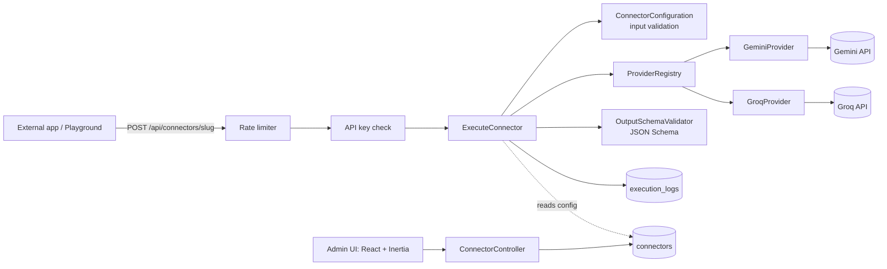

# Universal AI API Hub

A configuration-driven platform for turning an AI prompt into a production-style HTTP API. Describe what an endpoint does, which inputs it takes, which provider and model runs it, and what JSON it must return. The hub generates the endpoint, the documentation and a test playground, validates every request and response, and records usage.

No code and no redeploy is needed to add an endpoint. A new connector is a database row, and one shared pipeline executes all of them.

## Submission details

| | |
| --- | --- |
| **Live application** | `https://universal-ai-api-hub-mw42.onrender.com` |
| **Dashboard** | `https://universal-ai-api-hub-mw42.onrender.com/connectors` |
| **API documentation** | `https://universal-ai-api-hub-mw42.onrender.com/connectors/{id}/docs` (linked from every connector) |
| **Health check** | `https://universal-ai-api-hub-mw42.onrender.com/health` |
| **Demo endpoints** | `POST https://universal-ai-api-hub-mw42.onrender.com/api/connectors/business-card-scanner`, `…/article-writer` (both public) and `…/content-rewriter` (requires an API key) |

No account or login is needed to open the application.

### Providers and demo connectors

| Connector | Processing | Provider / model | Input | Output |
| --- | --- | --- | --- | --- |
| **Business Card Scanner** | Image, vision | Google Gemini, `gemini-3.6-flash` | `card_image` (JPEG, PNG or WebP, up to 4 MB) | `name`, `company`, `designation`, `phone`, `email`, `website` |
| **Invoice Scanner** | Image, vision | Google Gemini, `gemini-3.6-flash` | `invoice_image` (JPEG, PNG or WebP, up to 4 MB) | `vendor`, `invoice_number`, `invoice_date`, `due_date`, `currency`, `subtotal`, `tax`, `total` |
| **Article Writer** | Text | Groq, `openai/gpt-oss-20b` | `topic` (text) | `title`, `body` |
| **Content Rewriter** | Text, API key required | Groq, `openai/gpt-oss-20b` | `text`, `instructions` | `rewritten`, `changes[]` |
| **Support Ticket Classifier** | Text, classification | Groq, `openai/gpt-oss-20b` | `ticket_text`, `customer_tier` | `category`, `urgency`, `sentiment`, `summary`, `key_issues[]`, `suggested_reply` |

All five are re-created on every boot by the seeder (`database/seeders/DatabaseSeeder.php`), so the demos always exist even after a database reset.

### Try it in 30 seconds

1. Open `/connectors` and click **Business Card Scanner**.
2. Click **Use sample** in the Playground. A fictional business card loads.
3. Click **Run test**. Structured JSON comes back with timing and token usage.
4. Click **Copy as cURL** to reproduce the same call from a terminal.
5. Open **Content Rewriter**, click **New key** under *API keys*, and copy the key (it is shown once). Call the endpoint with and without it:

```bash
curl -X POST 'https://universal-ai-api-hub-mw42.onrender.com/api/connectors/content-rewriter' \
  -H 'Authorization: Bearer <the key>' \
  -H 'Content-Type: application/json' \
  -d '{"text": "our product is really good, you should buy it", "instructions": "Make it professional"}'
```

Without a key, or after revoking it, the same call returns `401 UNAUTHORIZED`, and the rejected attempt appears in the connector's execution log.

Other connectors offer the same **Use sample** button when their fields have example values. **New connector** offers one-click templates for Card Scanner, Article Writer, Invoice Scanner and Content Rewriter.

## Sample requests and responses

### Business Card Scanner (image input, Gemini)

```bash
curl -X POST 'https://universal-ai-api-hub-mw42.onrender.com/api/connectors/business-card-scanner' \
  -H 'Accept: application/json' \
  -F 'card_image=@business-card.png'
```

A ready-made test image is at [`public/samples/business-card.png`](public/samples/business-card.png).

```json
{
  "success": true,
  "data": {
    "name": "Priya Nair",
    "company": "LUMINA LABS",
    "designation": "Senior Product Designer",
    "phone": "+91 98765 43210",
    "email": "priya.nair@luminalabs.example",
    "website": "www.luminalabs.example"
  },
  "error": null,
  "meta": {
    "provider": "gemini",
    "model": "gemini-3.6-flash",
    "duration_ms": 3767,
    "usage": { "input_tokens": 1164, "output_tokens": 64, "total_tokens": 1517 }
  }
}
```

### Article Writer (text input, Groq)

```bash
curl -X POST 'https://universal-ai-api-hub-mw42.onrender.com/api/connectors/article-writer' \
  -H 'Content-Type: application/json' \
  -d '{"topic": "Tea vs coffee"}'
```

```json
{
  "success": true,
  "data": {
    "title": "Tea vs. Coffee: A Quick Comparison",
    "body": "Tea and coffee are the world's two most popular caffeinated beverages…"
  },
  "error": null,
  "meta": {
    "provider": "groq",
    "model": "openai/gpt-oss-20b",
    "duration_ms": 1082,
    "usage": { "input_tokens": 172, "output_tokens": 377, "total_tokens": 549 }
  }
}
```

### Error response

Every failure uses the same envelope. Branch on `error.code`, which is stable.

```json
{
  "success": false,
  "data": null,
  "error": {
    "code": "INPUT_VALIDATION_FAILED",
    "message": "One or more inputs are invalid.",
    "fields": { "topic": ["This field is required."] }
  }
}
```

## Architecture



**Design decisions**

- **One pipeline, many connectors.** `app/Services/ExecuteConnector.php` runs every connector. Connectors are data (`connectors` table), not code. There are no generated files and no per-connector routes. One route, `/api/connectors/{slug}`, serves all of them.
- **Provider adapters.** Each provider implements `App\Contracts\AiProvider`. `ProviderRegistry` resolves it by name. Adding a provider means one class, one registry entry and one config entry.
- **Provider keys stay on the server.** They are read from environment variables only and are never included in responses, docs or the frontend bundle.
- **Structured output is enforced twice.** The schema is sent to the provider (Gemini's `responseJsonSchema`, Groq's JSON mode plus the schema in the instructions). The response is then validated locally against the connector's JSON Schema with `opis/json-schema`. A response that does not match is rejected as `OUTPUT_SCHEMA_MISMATCH`, never passed through.
- **Docs and playground come from the same definition as the endpoint,** so they cannot drift from the real contract.

### Request lifecycle

1. The rate limiter checks the client (per IP) and the connector (global).
2. The API key middleware runs when the connector requires one.
3. `ExecuteConnector` refuses inactive connectors, then writes an `execution_logs` row with status `running`.
4. `ConnectorConfiguration::normalizeInput` reads only the request body, rejects unknown fields and coerces or validates each field by type (text, number, boolean, image, file, JSON) with size and length limits.
5. The provider adapter builds the provider-specific request and calls it with a timeout.
6. `OutputSchemaValidator` decodes the response (tolerating Markdown fences) and validates it against the schema.
7. The log row is updated with status, duration and token usage, and a failure is recorded with its error code.
8. The response envelope is returned.

## Reliability and security

- **Failures are never raw.** Validation errors, unknown connectors, wrong HTTP methods, malformed JSON, provider failures, timeouts, rate limits and unexpected exceptions all return the same JSON envelope with a stable code. Unexpected exceptions are reported to the log, and the caller only sees `INTERNAL_ERROR`.
- **Failed calls are recorded** with an error code, so they appear in the connector's statistics.
- **Limits:**
  - Uploads: 4 MB per file (`AI_HUB_MAX_UPLOAD_KB`). The Docker image raises PHP's stock 2 MB upload limit so this limit is the one that applies.
  - Text and JSON fields: 20,000 characters (`AI_HUB_MAX_TEXT_CHARS`).
  - Rate: 20 requests per minute per client (`AI_HUB_RATE_LIMIT_PER_MINUTE`) plus 120 per minute per connector (`AI_HUB_CONNECTOR_RATE_LIMIT_PER_MINUTE`). Responses carry `X-RateLimit-*` headers, and a `429` carries `Retry-After`.
- **Uploads** are checked by detected MIME type (JPEG, PNG or WebP for images, TXT or JSON for files), not by file extension.
- **Per-connector API keys:**
  - A connector set to `api_key` requires a key issued for that connector, sent as `Authorization: Bearer <key>` or `X-API-Key`.
  - Keys look like `uah_` plus 40 random characters. Only a SHA-256 hash and a short display prefix are stored. The plaintext is returned once, in a `Cache-Control: no-store` response, and never again.
  - A key for one connector is rejected by every other connector.
  - Keys can be revoked, which takes effect immediately. Each key records when it was last used, and every successful call is attributed to the key that made it.
  - Rejected attempts are logged as failed requests with `UNAUTHORIZED`.
  - A connector can have up to 10 active keys.
- **Trusted proxies** are enabled so per-client rate limiting sees the real client IP behind Render's proxy.

### Error codes

| HTTP | Code | Meaning |
| --- | --- | --- |
| 400 | `INVALID_JSON` | Request body is not valid JSON |
| 401 | `UNAUTHORIZED` | API key missing, invalid, revoked, or issued for another connector |
| 403 | `CONNECTOR_NOT_ACTIVE` | Connector is draft or disabled |
| 404 | `CONNECTOR_NOT_FOUND` / `NOT_FOUND` | Unknown connector slug or route |
| 405 | `METHOD_NOT_ALLOWED` | Endpoints accept POST only |
| 422 | `INPUT_VALIDATION_FAILED` | Invalid input (see `error.fields`) |
| 422 | `MODEL_INPUT_UNSUPPORTED` | The model cannot take file or image inputs |
| 429 | `RATE_LIMITED` | Too many requests (see `retry_after_seconds`) |
| 500 | `INTERNAL_ERROR` | Unexpected error (details in server logs) |
| 502 | `PROVIDER_ERROR`, `INVALID_PROVIDER_RESPONSE`, `OUTPUT_SCHEMA_MISMATCH` | The provider failed or returned unusable output |
| 503 | `PROVIDER_RATE_LIMITED`, `PROVIDER_NOT_CONFIGURED`, `PROVIDER_UNAVAILABLE` | Provider or server configuration unavailable |
| 504 | `PROVIDER_TIMEOUT` | The provider did not respond in time |

## Features

**Required by the brief**

- Connector CRUD with provider, model, instructions, inputs, output schema, authentication mode and active/draft/disabled status
- All six input types: text, number, boolean, image, file, JSON, with required flags and descriptions
- Multiple providers behind one adapter interface (Gemini and Groq)
- Generated documentation per connector: endpoint, authentication, request fields, cURL, JavaScript and Python examples, success and error responses, limits and error codes
- Test interface with dynamic form, running state, response, errors, timing and token usage
- Persistent execution logging with statistics: total, succeeded and failed requests, last used, latency, tokens, provider, model and error code
- Dashboard listing every connector with provider, model, input types, status, requests and last use
- Responsive layout with light and dark themes

**Beyond the brief**

- **Per-connector API keys**: hashed at rest, shown once, revocable, with last-used tracking and per-key attribution in the logs
- **Provider health**: the dashboard shows whether each provider's credentials are configured on the server
- **Rate limiting** with per-client and per-connector limits, standard headers and a structured `RATE_LIMITED` error
- **Text length caps** alongside upload size limits
- **Connector templates** for the brief's four example use cases
- **Sample inputs** with a bundled sample business card and invoice, and a one-click "Use sample" in the playground
- **Copy as cURL** built from the values entered in the playground
- Strict JSON Schema validation of every provider response
- Search and status filtering on the dashboard, success-rate visualisation, execution history per connector
- Self-healing deploy: migrations and demo connectors are applied on every boot

## Running locally

Requirements: PHP 8.3+, Composer, Node 22+.

```bash
composer setup                # install, create .env, generate key, migrate, build assets
php artisan db:seed           # demo connectors
# add GEMINI_API_KEY and GROQ_API_KEY to .env
composer run dev              # app + Vite dev server
```

Then open `http://localhost:8000`.

### Environment variables

| Variable | Purpose |
| --- | --- |
| `GEMINI_API_KEY`, `GROQ_API_KEY` | Provider credentials (server-side only) |
| `AI_PROVIDER_TIMEOUT_SECONDS` | Provider call timeout (default 40) |
| `AI_HUB_MAX_UPLOAD_KB` | Per-file upload limit (default 4096) |
| `AI_HUB_MAX_TEXT_CHARS` | Per-field text limit (default 20000) |
| `AI_HUB_RATE_LIMIT_PER_MINUTE` | Requests per client per minute (default 20) |
| `AI_HUB_CONNECTOR_RATE_LIMIT_PER_MINUTE` | Requests per connector per minute (default 120) |

### Tests

```bash
php artisan test
```

The tests use a fake provider, so they make no network calls and use no API quota. They cover the shared execution pipeline, API key issuing, scoping and revocation, input validation, malformed JSON, unknown connectors and methods, query-string handling, text limits and rate limiting.

## Deployment

Deployed on **Render** as a Docker web service with a managed PostgreSQL database, defined in [`render.yaml`](render.yaml) and built by the multi-stage [`Dockerfile`](Dockerfile): Composer dependencies, a Vite production build, then PHP 8.4 with Apache.

- `docker/start.sh` runs migrations and the seeder on boot, caches config, routes and views, then starts Apache on Render's `$PORT`.
- `docker/php.ini` raises PHP's upload limits above the application's own 4 MB cap.
- Provider keys are set in the Render dashboard (`sync: false` keeps them out of the repository).
- `/health` is the health check. On Render's free plan an idle service sleeps, so the first request after a quiet period can take up to about a minute. Pointing an uptime monitor at `/health` keeps the service warm.

## Trade-offs and known limitations

- **The admin UI has no login,** as the brief requires evaluators to test without an account. Anyone with the URL can edit connectors. This is acceptable for an evaluation deployment and would be the first thing to change for real use.
- **Models are configured, not discovered.** The model field accepts any identifier and suggests the curated defaults in `config/ai-hub.php`. It does not yet fetch each provider's live model list.
- **Groq connectors are text-only** in this release. Image and file inputs are offered only for providers with `supports_images` set in configuration.
- **Costs are not estimated.** Token usage is recorded when the provider reports it.
- **Rate limits use the application cache.** That is correct for a single instance. Multiple instances would need a shared cache such as Redis.
